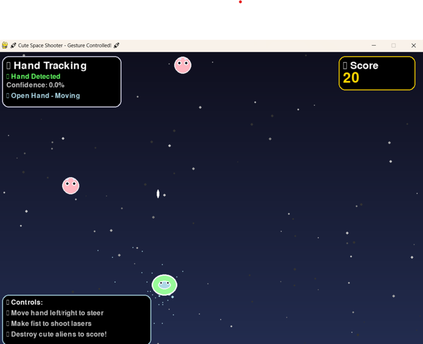

# 🚀 Space Shooter - Gesture Controlled Game

A delightful space shooter game controlled entirely by hand gestures! Wave your hand to move your spaceship and make a fist to shoot lasers at adorable alien enemies.




## ✨ Features

- **🖐️ Hand Gesture Control**: Move your spaceship by moving your hand left and right
- **👊 Fist to Fire**: Make a fist to shoot glowing laser beams
- **🎨 Cute Pastel Theme**: Beautiful space aesthetic with adorable alien enemies
- **⭐ Particle Effects**: Stunning visual effects including trails, explosions, and twinkling stars
- **📊 Real-time Hand Tracking**: Live feedback on hand detection and gesture recognition
- **🎯 Score System**: Destroy aliens to increase your score
- **💫 Smooth Animations**: Fluid spaceship movement and engaging visual effects

## 🎮 How to Play

1. **Position Your Hand**: Hold your hand in front of your webcam
2. **Move to Steer**: Move your open hand left and right to control your spaceship
3. **Make Fist to Shoot**: Close your hand into a fist to fire laser beams
4. **Destroy Aliens**: Aim and shoot the cute pink aliens falling from space
5. **Avoid Collisions**: Don't let the aliens touch your spaceship!

## 🛠️ Installation

### Prerequisites

Make sure you have Python 3.7+ installed on your system.

### Required Libraries

```bash
pip install pygame
pip install opencv-python
pip install mediapipe
pip install numpy
```

### Quick Setup

1. Clone this repository:
```bash
git clone https://github.com/bhoomisurve/Gesture-controlled-space-shooter-game.git
cd Gesture-controlled-space-shooter-game.git
```

2. Install dependencies:
```bash
pip install -r requirements.txt
```

3. Run the game:
```bash
python main.py
```


## 🎯 Game Controls

| Gesture | Action |
|---------|--------|
| ✋ Open Hand | Move spaceship left/right |
| 👊 Closed Fist | Fire laser beams |
| R Key | Restart game (when game over) |
| Q Key | Quit game |

## 🎨 Game Elements

- **🛸 Your Spaceship**: A cute mint-green spaceship with eyes and glowing trail
- **👽 Alien Enemies**: Adorable pink aliens with antennae that gently float down
- **⚡ Laser Beams**: Golden glowing projectiles with particle effects
- **⭐ Background**: Animated starfield with twinkling effects
- **💥 Explosions**: Colorful particle explosions when aliens are destroyed

## 📱 System Requirements

- **Webcam**: Required for hand gesture detection
- **Python**: 3.7 or higher
- **RAM**: 4GB minimum (8GB recommended)
- **Graphics**: Any modern graphics card for smooth particle effects
- **Operating System**: Windows, macOS, or Linux

## 🔧 Technical Details

### Hand Tracking Technology
- Uses **MediaPipe** for real-time hand landmark detection
- Tracks 21 hand landmarks for precise gesture recognition
- Confidence-based detection system for reliable control

### Game Architecture
- **Object-Oriented Design**: Clean class structure for game entities
- **Particle System**: Advanced particle effects for trails and explosions
- **Collision Detection**: Efficient bounding box collision system
- **60 FPS Gameplay**: Smooth animation and responsive controls

## 🐛 Troubleshooting

### Camera Issues
- Ensure your webcam is connected and not being used by another application
- Try running the game as administrator if camera access is denied
- Check webcam permissions in your system settings

### Performance Issues
- Close other applications to free up system resources
- Reduce the number of particles if experiencing lag
- Ensure good lighting for better hand detection

### Hand Detection Problems
- Make sure your hand is well-lit and clearly visible
- Keep your hand within the camera frame
- Try adjusting the camera angle for better detection

## 🔄 Game States

1. **Playing**: Active gameplay with hand control enabled
2. **Game Over**: Collision detected, showing final score and restart options
3. **Hand Tracking**: Continuous monitoring of hand gestures and confidence levels

## 🌟 Future Enhancements

- [ ] Power-ups and special weapons
- [ ] Multiple enemy types with different behaviors  
- [ ] Boss battles with unique mechanics
- [ ] Sound effects and background music
- [ ] High score leaderboard
- [ ] Multiple difficulty levels
- [ ] Gesture calibration system

## 🤝 Contributing

Contributions are welcome! Feel free to:

1. Fork the repository
2. Create a feature branch (`git checkout -b feature/amazing-feature`)
3. Commit your changes (`git commit -m 'Add amazing feature'`)
4. Push to the branch (`git push origin feature/amazing-feature`)
5. Open a Pull Request


## 👨‍💻 Author

**Bhoomika Surve**
- GitHub: [@bhoomisurve](https://github.com/bhoomisurve)
- Email: survebhoomika@egmail.com

## 🙏 Acknowledgments

- **MediaPipe** team for the incredible hand tracking technology
- **Pygame** community for the game development framework
- **OpenCV** for computer vision capabilities
- Inspiration from classic space shooter games


**Enjoy playing! 🚀✨**

> Don't forget to star ⭐ this repository if you found it interesting!
